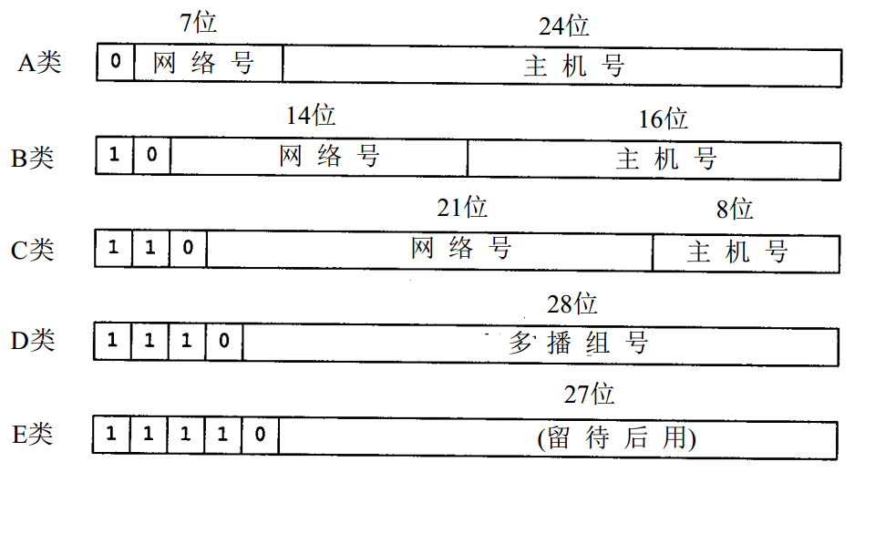

# IP 地址分类（A、B、C、D、E类)

## IP 地址类型

每个 IP 地址由 4 个字节（32 位）组成，包括两个标识码（ID），即网络号和主机号：

1. 第一个字段是网络号（net-id），它标志主机或路由器所连接的网络。一个网络号在整个因特网内必须是唯一的。

2. 第二个字段是主机号（host-id），它标志该主机（或路由器）。一个主机号在它前面的网络号所指明的网络范围内必须是唯一的。

IP 地址根据网络号的不同分为 5 种类型：A 类地址、B 类地址、C 类地址、D 类地址和 E 类地址。



## A 类地址

一个 A 类地址由 ```1``` 个字节的网络地址和 ```3``` 个字节的主机地址组成，网络地址的最高位必须是 **```0```** ， 地址范围从 ```0.0.0.0``` 到 ```127.255.255.255```。

注：

- 地址范围取值规则：除最高位 **```0```** 之外，其他位，全 ```0``` 表示最小值，全 ```1``` 表示最大值，所以地址范围从 ```0.0.0.0``` 到 ```127.255.255.255```
- ```0.0.0.0```：并不是一个真实的的 IP 地址，它表示本机中所有的 IPV4 地址
- ```127.0.0.1```：以 ```127``` 开头的 IP 地址，都是回环地址（Loop back address），其所在的回环接口一般被理解为虚拟网卡，并不是真正的路由器接口
   - 所谓的回环地址，就是我们在主机上发送给 ```127``` 开头的 IP 地址的数据包会被发送的主机自己接收，根本传不出去，外部设备也无法通过回环地址访问到本机
   - 所有网络号为 ```127``` 的地址都被称之为回环地址，```127.0.0.1``` 只是 ```{127.}``` 集合中的一个元素，它们是包含关系，即回环地址包含 ```127.0.0.1```，所以 ```回环地址 != 127.0.0.1```

## B 类地址

一个 B 类地址由 ```2``` 个字节的网络地址和 ```2``` 个字节的主机地址组成，网络地址的最高位必须是 **```10```**，地址范围从 ```128.0.0.0``` 到 ```191.255.255.255```。

注：

- 地址范围取值规则：除最高位 **```10```** 之外，其他位，全 ```0``` 表示最小值，全 ```1``` 表示最大值，所以地址范围从 ```128.0.0.0``` 到 ```191.255.255.255```

## C 类地址

一个 C 类地址由 ```3``` 个字节的网络地址和 ```1``` 个字节的主机地址组成，网络地址的最高位必须是 **```110```**。地址范围从 ```192.0.0.0``` 到 ```223.255.255.255```。

注：

- 地址范围取值规则：除最高位 **```110```** 之外，其他位，全 ```0``` 表示最小值，全 ```1``` 表示最大值，所以地址范围从 ```192.0.0.0``` 到 ```223.255.255.255```

## D 类地址

D 类地址用于多点广播（Multicast），以 **```lll0```** 开始，它是一个专门保留的地址，并不指向特定的网络。地址范围从 ```224.0.0.0``` 到 ```239.255.255.255```。

注：

- 地址范围取值规则：除最高位 **```lll0```** 之外，其他位，全 ```0``` 表示最小值，全 ```1``` 表示最大值，所以地址范围从 ```224.0.0.0``` 到 ```239.255.255.255```

## E 类地址

E 类地址，以 **```llll0```** 开始，为将来使用保留。地址范围从 ```240.0.0.0``` 到 ```247.255.255.255```。

注：

- 地址范围取值规则：除最高位 **```llll0```** 之外，其他位，全 ```0``` 表示最小值，全 ```1``` 表示最大值，所以地址范围从 ```240.0.0.0``` 到 ```247.255.255.255```


## ```255.255.255.255```

全 ```1``` 的 IP 地址 ```255.255.255.255``` 是当前子网的广播地址。

|类型|地址范围|
|--|--|
|A|```0.0.0.0``` 到 ```127.255.255.255```|
|B|```128.0.0.0``` 到 ```191.255.255.255```|
|C|```192.0.0.0``` 到 ```223.255.255.255```|
|D|```224.0.0.0``` 到 ```239.255.255.255```|
|E|```240.0.0.0``` 到 ```247.255.255.255```|
